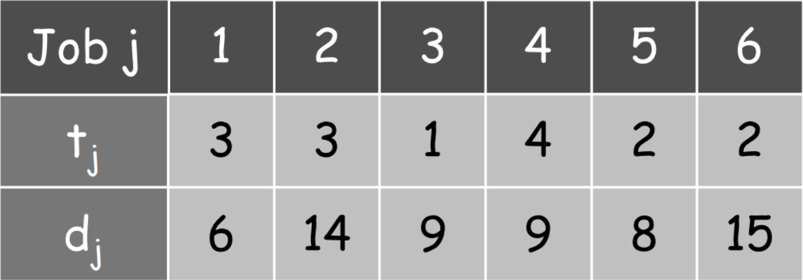
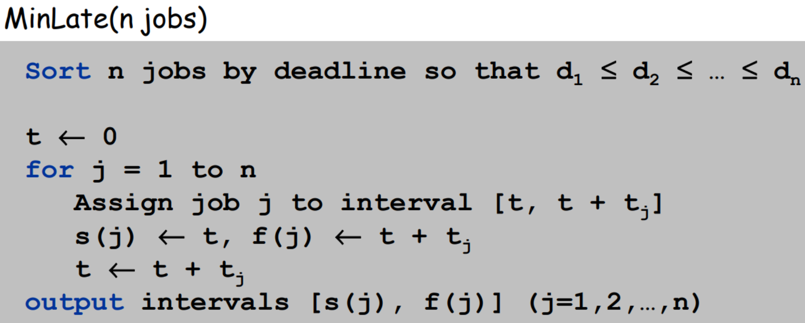
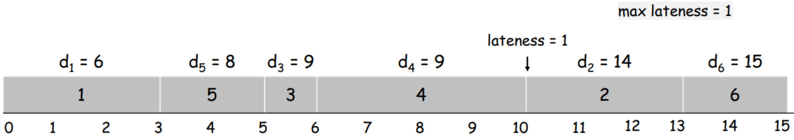

# Minimizing Lateness
Greedy Algorithm to minimize lateness when scheduling jobs on a processor

## Problem Statement
- Processor can process 1 job at a time
- Job `j` requires tj units of processing time and is due at time dj
-  `j` starts at time **s(j)**, it finishes at time **f(j)** = s(j) + tj
- **Lateness =**  max {0, f(j) – dj}
- **Goal: schedule all jobs to minimize the maximum lateness**

### Input Jobs

## Algorithm
**Consider jobs with Earlieast Deadline first**  

### Runtime
Sorting O(n log(n)) + for-loop Θ(n)  
**O(n log(n))**

## Optimal Job Ordering
  
#### Max Lateness = 1

## References
- [Tudelft slides](https://ocw.tudelft.nl/wp-content/uploads/Algoritmiek_Scheduling_to_Minimize_Maximum_Lateness.pdf)
- [Kevin Wayne slides](https://www.cs.princeton.edu/courses/archive/spring13/cos423/lectures/04GreedyAlgorithmsI-2x2.pdf)
- [Srinivasan Parthasarathy slides](https://www.cs.umd.edu/class/sum2005/cmsc451/lateness.pdf)
- [Carl Kingsford slides](https://www.cs.umd.edu/class/fall2009/cmsc451/lectures/Lec05a-minlate.pdf)
- [Chandra Chekuri slides](https://courses.engr.illinois.edu/cs473/fa2010/Lectures/lecture11.pdf)
